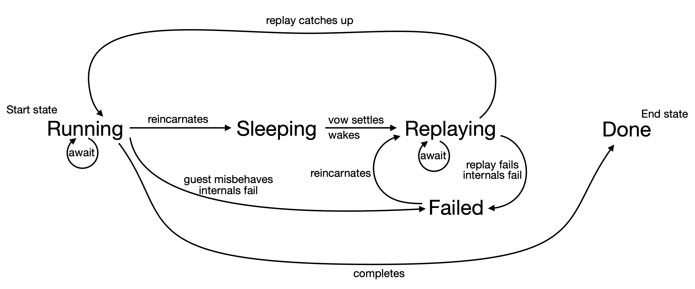

# Async Flow States

 A prepared guest async function is like an exoClass (and is internally implemented by an exoClass). It is primarily represented by the host wrapper function that `asyncFlow` returns. Each call on that wrapper function creates an activation of that guest function. A guest activation is like an exoClass instance (and is internally implemented as an instance of the function's internal exoClass). The state diagram shows the lifecycle of a guest function activation

- ***Running***. Invoking the wrapper function creates an activation that is initially in the ***Running*** state. Actions the guest takes in the ***Running*** state, like invoking a host-provided API, cause actual effects and are also recorded for replay. The log records both actions initiated by the guest such as `checkCall`, and actions initiated by the host such as `doFulfill`. But it both cases it logs only host-side objects, since the log needs to survive an upgrade.

- ***Sleeping***. An activation that was ***Running*** just before an upgrade revives into the new incarnation in the ***Sleeping*** state ready to replay from scratch once it awakens. The previous log is intact, but the log's "program counter" is reset to zero. The membrane bijection starts empty since no guest object survives an upgrade. Since an upgrade can only happen between cranks, and therefore between turns, the ***Running*** activation must have been awaiting a vow. When a vow settles, then any ***Sleeping*** activation that might have been awaiting that vow wakes and starts ***Replaying***. An activation can also optionally be configured to be an "eager waker". On revival, a ***Sleeping*** eager waker immediately wakes and starts ***Replaying***. The tradeoff is when to pay the costs of replay.

- ***Replaying***. To start ***Replaying***, the activation first translates the saved activation arguments from host to guest, invokes the guest function, and starts the membrane replaying from its durable log. The replay is finished when the last log entry has been replayed. Once replaying is finished, the activation has caught up and transitions back to ***Running***.

- ***Failed***. If during the ***Replaying*** state the guest activation fails to exactly reproduce its previously logged behavior, it goes into the inactive ***Failed*** state, with a diagnostic explaining how the replay failed, so it can be repaired by another future upgrade. As of the next reincarnation, the failure status is cleared and it starts ***Replaying*** again, hoping not to fail this time. If replay failed because the guest async function did not reproduce its previous behavior, then the upgrade needs to replace the function with one which does. If the replay failed because of a failure of the `asyncFlow` mechanism, whether a bug or merely hitting a case that is not yet implemented, then the upgrade needs to replace the relevant part of `asyncFlow`'s mechanism.

- ***Done***. The guest async function invocation returned a promise for its eventual outcome. Once that promise settles, we assume that the job of the guest activation is done. It then goes into a durably ***Done*** state, dropping all its bookkeeping beyond just remembering the corresponding settled outcome vow, and that it is ***Done***. The replay logs and membrane state of this activation are dropped, to be garbage collected.
