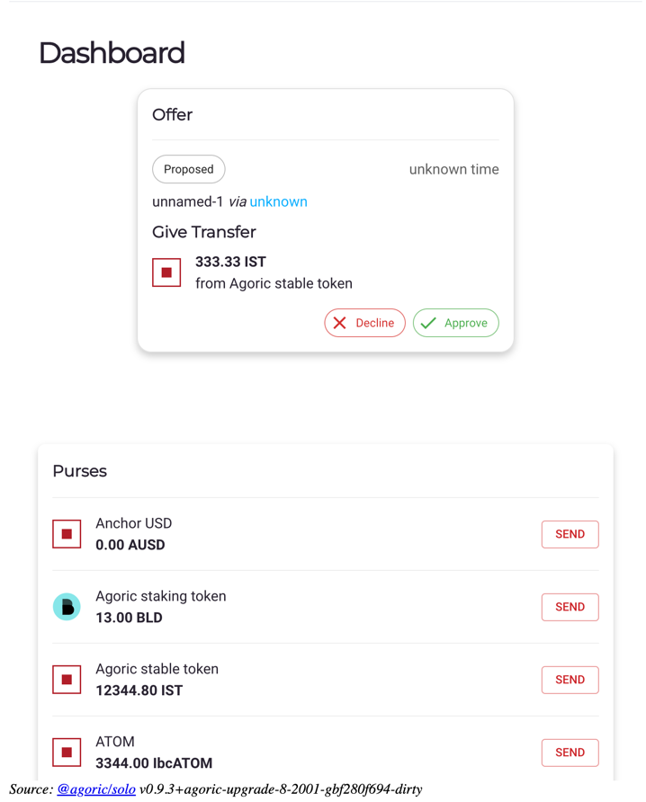
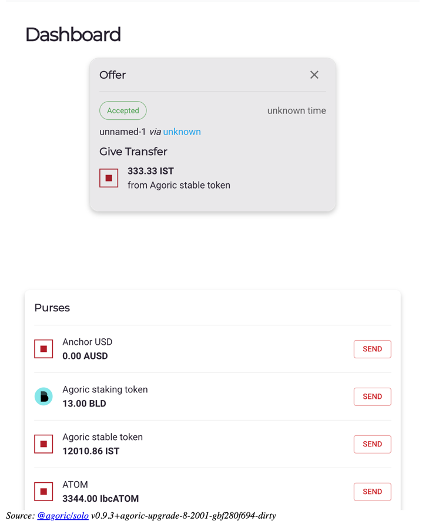
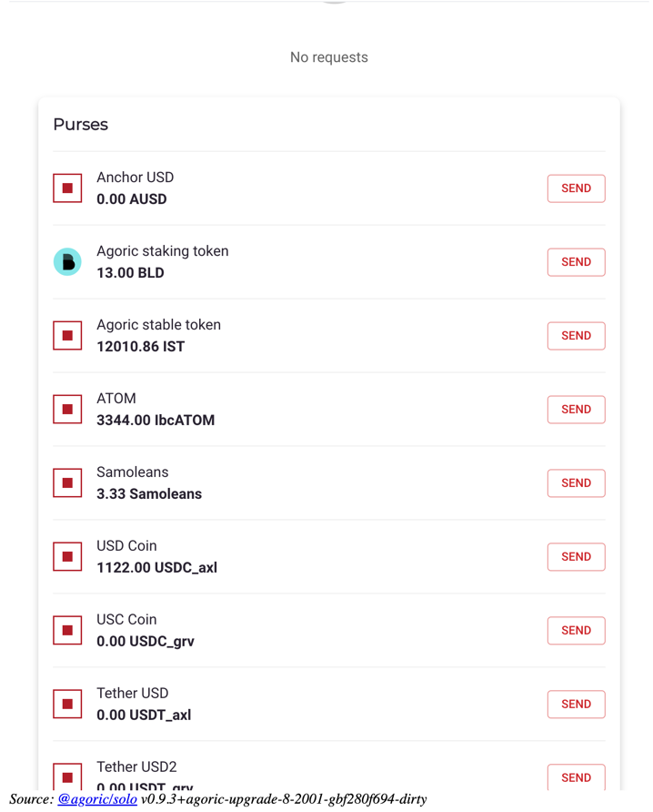

# Local IBC Demo
This is a tutorial aiming developers to make it easier to understand how IBC works with the pegasus package. Throughout
this tutorial you will;
* Send IST to another chain using IBC
* Receive a token over IBC and view it in your wallet

```mermaid
flowchart LR
    subgraph Local Machine
        A(( ibc-0  )) -->|Samoleans| B((agoriclocal))
        B --> |IST| A
    end
```

## Prerequisites
* [Hermes](https://hermes.informal.systems/quick-start/installation.html)
* [Gaia and Gaiad Manager](https://hermes.informal.systems/tutorials/pre-requisites/gaia.html)
  * If you're on an M1 Mac you also have to install Rosetta
* [agoric-sdk](https://docs.agoric.com/guides/getting-started/)
* [jq](https://stedolan.github.io/jq/download/)

## Components
* **Relayer**: Hermes
* **Counter Chain**: CosmosHub
* **Pegasus**: Agoric VM's IBC interface

## Before You Start
At time of writing this(2023-04-26), there are a few adjustments to `agoric-sdk` that needs to be done.

### Inject `pegasusConnections` to ag-solo's `home` object
1. Add below code at the end of `pegasus/src/proposals/core-proposal.js`
  ```js
  export const publishConnections = async ({
   consume: { pegasusConnections: pegasusConnectionsP, client },
  }) => {
  const pegasusConnections = await pegasusConnectionsP;
  // FIXME: Be sure only to give the client the connections if _addr is on the
  // allowlist.
  return E(client).assignBundle([_addr => ({ pegasusConnections })]);
  };
  harden(publishConnections);
  ```
2. Update `getManifestForPegasus` to below version
  ```js
  export const getManifestForPegasus = ({ restoreRef }, { pegasusRef }) => ({
    manifest: {
      startPegasus: {
        consume: { board: t, namesByAddress: t, zoe: t },
        installation: {
          consume: { [CONTRACT_NAME]: t },
        },
        instance: {
          produce: { [CONTRACT_NAME]: t },
        },
      },
      listenPegasus: {
        consume: { networkVat: t, pegasusConnectionsAdmin: t, zoe: t },
        produce: { pegasusConnections: t, pegasusConnectionsAdmin: t },
        instance: {
          consume: { [CONTRACT_NAME]: t },
        },
      },
      [publishConnections.name]: {
        consume: { pegasusConnections: t, client: t },
      },
    },
    installations: {
      [CONTRACT_NAME]: restoreRef(pegasusRef),
    },
  });
  ```
3. This step depends on how you want to start your local agoric chain. If you are going to use `make scenario2-run-chain-economy`
skip this step. But if your choice is to start the local chain with `make scenario2-run-chain` update `vats/decentral-devnet-config.json`
by adding `"@agoric/pegasus/scripts/init-core.js"` as the first element of the array with the `"coreProposals"` key:
  ```json
  {
    "$comment": "This SwingSet config file (see loadSwingsetConfigFile) includes non-production facilities such as a faucet. Pending #5819, it includes vaults in coreProposals; once #5819 is done, vaults are expected to be added by devnet governance.",
    "bootstrap": "bootstrap",
    "defaultReapInterval": 1000,
    "coreProposals": [
      "@agoric/pegasus/scripts/init-core.js",
      "@agoric/vats/scripts/init-core.js",
      {
        "module": "@agoric/inter-protocol/scripts/init-core.js",
        "entrypoint": "defaultProposalBuilder",
        "args": [
          {
            "econCommitteeOptions": {
              "committeeSize": 3
            },
            "endorsedUi": "bafybeidvpbtlgefi3ptuqzr2fwfyfjqfj6onmye63ij7qkrb4yjxekdh3e",
     .....
  }
  ```

### Fix `pegasusConnectionsAdmin.update()`
I've discovered a potential bug in `pegasus/src/proposals/core-proposal.js`, in future this bug will probably get fixed
but until then you need to update `addPegasusTransferPort` method to this:

```js
export const addPegasusTransferPort = async (
  port,
  pegasus,
  pegasusConnectionsAdmin,
) => {
  const { handler, subscription } = await E(pegasus).makePegasusConnectionKit();
  observeIteration(subscription, {
    updateState(connectionState) {
      const { localAddr, actions } = connectionState;
      if (actions) {
        // We're open and ready for business.
        E(pegasusConnectionsAdmin).update(localAddr, connectionState); // !!! Wrap around E()
      } else {
        // We're closed.
        E(pegasusConnectionsAdmin).delete(localAddr); // !!! Wrap around E()
      }
    },
  });
  return E(port).addListener(
    Far('listener', {
      async onAccept(_port, _localAddr, _remoteAddr, _listenHandler) {
        return handler;
      },
      async onListen(p, _listenHandler) {
        console.debug(`Listening on Pegasus transfer port: ${p}`);
      },
    }),
  );
};
```

## Running The Demo
### Prepare Cosmos Chain
> Ignore error messages containing `ibc-1`

Start nodes

```shell
cd ~
gm start ibc-0 node-0
gm status
```

Should see something similar to:

```text
anil@Anils-MacBook-Pro ~ % gm status
NODE               PID    RPC   APP  GRPC  HOME_DIR
ibc-0            82624  27010 27011 27012  /Users/anil/.gm/ibc-0 
 node-0          82832  27030 27031 27032  /Users/anil/.gm/node-0 
ibc-1                -      -     -     - (/Users/anil/.gm/ibc-1)
 node-1              -      -     -     - (/Users/anil/.gm/node-1)
```

Generate private keys for `hermes`

```shell
gm keys
```

Add generate private keys to `hermes`

```shell
gm hermes keys
```

### Hermes Config
Copy and paste below configuration to your `$HOME/.hermes/config.toml`

```text
[global]
log_level = 'info'

[mode]

[mode.clients]
enabled = true
refresh = true
misbehaviour = true

[mode.connections]
enabled = true

[mode.channels]
enabled = true

[mode.packets]
enabled = true
clear_interval = 100
clear_on_start = true
tx_confirmation = true

[telemetry]
enabled = true
host = '127.0.0.1'
port = 3001

[[chains]]
id = 'ibc-0'
rpc_addr = 'http://localhost:27030'
grpc_addr = 'http://localhost:27032'
websocket_addr = 'ws://localhost:27030/websocket'
rpc_timeout = '15s'
account_prefix = 'cosmos'
key_name = 'wallet1'
store_prefix = 'ibc'
gas_price = { price = 0.001, denom = 'stake' }
gas_multiplier = 1.1
default_gas = 1000000
max_gas = 10000000
max_msg_num = 30
max_tx_size = 2097152
clock_drift = '5s'
max_block_time = '30s'
trusting_period = '14days'
trust_threshold = { numerator = '2', denominator = '3' }

# [chains.packet_filter]
# policy = 'allow'
# list = [
#   ['ica*', '*'],
#   ['transfer', 'channel-0'],
# ]

[[chains]]
id = 'agoriclocal'
rpc_addr = 'http://localhost:26657'
grpc_addr = 'http://localhost:9090'
websocket_addr = 'ws://localhost:26657/websocket'
rpc_timeout = '15s'
account_prefix = 'agoric1'
key_name = 'ag-solo'
store_prefix = 'ibc'
gas_price = { price = 0.001, denom = 'ubld' }
gas_multiplier = 1.1
default_gas = 1000000
max_gas = 10000000
max_msg_num = 30
max_tx_size = 2097152
clock_drift = '5s'
max_block_time = '30s'
trusting_period = '14days'
trust_threshold = { numerator = '2', denominator = '3' }

# [chains.packet_filter]
# policy = 'allow'
# list = [
#   ['ica*', '*'],
#   ['transfer', 'channel-0'],
# ]
```

### Prepare Agoric Chain
Open a new terminal and start a local agoric chain by typing below commands

```shell
cd agoric-sdk/packages/cosmic-swingset
make scenario2-setup && make scenario2-run-chain
```

Open another terminal and start ag-solo

```shell
cd agoric-sdk/packages/cosmic-swingset
make scenario2-run-client
```

In a new terminal, open your wallet UI

```shell
cd agoric-sdk/packages/cosmic-swingset
agoric open --repl
```

### Add `ag-solo`'s keys to `hermes`

Create a seed file under `$HOME/.hermes/` containing `ag-solo`'s key info

```shell
cd agoric-sdk/packages/cosmic-swingset
agd --home t1/8000/ag-cosmos-helper-statedir/ --keyring-backend=test keys show ag-solo --output json > $HOME/.hermes/ag-solo_key_seed.json
```

Add `ag-solo`'s mnemonic to `ag-solo_key_seed.json`

```shell
cd agoric-sdk/packages/cosmic-swingset
jq --arg mnemonic "$(cat t1/8000/ag-solo-mnemonic)"  '. + {mnemonic: $mnemonic}'  $HOME/.hermes/ag-solo_key_seed.json > $HOME/.hermes/ag-solo_tmp.json && cat $HOME/.hermes/ag-solo_tmp.json > $HOME/.hermes/ag-solo_key_seed.json && rm $HOME/.hermes/ag-solo_tmp.json
jq . $HOME/.hermes/ag-solo_key_seed.json
```

Should output something like this

```json
{
  "name": "ag-solo",
  "type": "local",
  "address": "agoric1jy006w0fx3q5mqyz5as57vvm32yalc0j6tvmm2",
  "pubkey": "{\"@type\":\"/cosmos.crypto.secp256k1.PubKey\",\"key\":\"AxQ6Ci1etkkk/rHfwKcUeyfpTE8I+vuG+DsPuwnNkVpc\"}",
  "mnemonic": "shop ignore brand tonight maid eternal setup payment seek bus fuel bunker awful stick group year betray quote nice stable catalog access indoor eagle"
}
```

Add `ag-solo` keys to `hermes`

```shell
hermes keys add --chain agoriclocal --key-file .hermes/ag-solo_key_seed.json --hd-path "m/44'/564'/0'/0/0" --overwrite
```


### Add New Relay Path
> Notice that we've used the port `pegasus` for the agoriclocal chain. This is necessary to operate using 
> pegasus package

Add the relay path

```shell
hermes create channel --a-chain ibc-0 --b-chain agoriclocal --a-port transfer --b-port pegasus --new-client-connection
```

Should output similar to:

```text
SUCCESS Channel {
    ordering: Unordered,
    a_side: ChannelSide {
        chain: BaseChainHandle {
            chain_id: ChainId {
                id: "ibc-0",
                version: 0,
            },
            runtime_sender: Sender { .. },
        },
        client_id: ClientId(
            "07-tendermint-0",
        ),
        connection_id: ConnectionId(
            "connection-0",
        ),
        port_id: PortId(
            "transfer",
        ),
        channel_id: Some(
            ChannelId(
                "channel-0",
            ),
        ),
        version: None,
    },
    b_side: ChannelSide {
        chain: BaseChainHandle {
            chain_id: ChainId {
                id: "agoriclocal",
                version: 0,
            },
            runtime_sender: Sender { .. },
        },
        client_id: ClientId(
            "07-tendermint-0",
        ),
        connection_id: ConnectionId(
            "connection-0",
        ),
        port_id: PortId(
            "pegasus",
        ),
        channel_id: Some(
            ChannelId(
                "channel-0",
            ),
        ),
        version: None,
    },
    connection_delay: 0ns,
}
```

After a successful connection you should be able to view your connection from REPL like this:


You can check your relay path like this

```shell
hermes query channels --show-counterparty --chain ibc-0
```

### Start Hermes

Start your `hermes` instance

```shell
hermes start
```

### Send IST to Local CosmosHub

There are two deploy scripts for this task:

* `deploy-peg-local.js`: Creates a peg that represents an ERTP asset that belongs to the agoric chain
* `deploy-ibc-send.js`: Sends the ERTP asset to the counter chain using pegasus instance

Before you send the IST, you first have to enter the destination address. To learn the destination address use below command:

```shell
gaiad --home ~/.gm/ibc-0 keys --keyring-backend="test" show wallet -a
```

Copy and past it's output to `pegasus/scripts/deploy-config.js` file's `cosmos.address` location:

```js
export default {
  agoric: {
    channel: 'channel-0',
    localPegId: 'peg-channel-0-IST',
  },
  cosmos: {
    address: [DESTINATION_ADDRESS] // Paste your output here!!!
  },
};
```

Run below command:

```shell
cd agoric-sdk/packages/pegasus
agoric deploy scripts/deploy-peg-local.js scripts/deploy-ibc-send.js
```

Run below command to query balances of the account on CosmosHub:

```shell
gaiad --node tcp://localhost:27030 query bank balances $(gaiad --home ~/.gm/ibc-0 keys --keyring-backend="test" show wallet1 -a)
```

Balances before the transfer should look like this:

```text
balances:
- amount: "100000000"
  denom: samoleans
- amount: "99999272"
  denom: stake
pagination:
  next_key: null
  total: "0"
```

Now open your wallet UI and your dashboard should similar to this:



Notice the IST balance is 12344.80 before you approve the offer. Now go on and approve the offer.
Once the offer is accepted your IST balance should decrease and the dashboard should look similar to this:



Now go on and check the balances on the other end of our ibc channel:

```text
balances:
- amount: "333333333"
  denom: ibc/792B2F2AD2AB87AFB998D1C0FE8F993AA7EEDA9FCE81E602EB2FC596FA393722
- amount: "100000000"
  denom: samoleans
- amount: "99999070"
  denom: stake
pagination:
  next_key: null
  total: "0"
```

We have sent IST to CosmosHub using pegasus!

### Send Samoleans to Agoric

To recieve and view assets from other chains you must create your peg using `pegRemote`. In the previous section
we created our peg using `pegLocal` because IST is a local asset to Agoric.

Create your remote peg by running below command:

```shell
cd agoric-sdk/packages/pegasus
agoric deploy scripts/deploy-peg-remote.js
```

After the command is executed successfully, you should view the purse for Samoleans from your wallet dashboard like
below:


Now it's time to send some samoleans from CosmosHub to Agoric. Before we do that we should check the balance on 
CosmosHub once more but this time pay attention to samoleans balance:

```text
balances:
- amount: "333333333"
  denom: ibc/792B2F2AD2AB87AFB998D1C0FE8F993AA7EEDA9FCE81E602EB2FC596FA393722
- amount: "100000000"
  denom: samoleans
- amount: "99999070"
  denom: stake
pagination:
  next_key: null
  total: "0"
```

We are good to send some samoleans to Agoric. To do that execute below command:

```shell
hermes tx ft-transfer --timeout-seconds 1000 --dst-chain agoriclocal --src-chain ibc-0 --src-port transfer --src-channel channel-0 --amount 3333333
```

Once the execution is successful, we should check the balances once again;

Pay attention to the decrease in samoleans balance, the balances on CosmosHub:

```text
balances:
- amount: "333333333"
  denom: ibc/792B2F2AD2AB87AFB998D1C0FE8F993AA7EEDA9FCE81E602EB2FC596FA393722
- amount: "96666667"
  denom: samoleans
- amount: "99998959"
  denom: stake
pagination:
  next_key: null
  total: "0"
```

Now your wallet UI should contain 3.33 samoleans in its corresponding purse, like this:



## Conclusion
We've tried to showcase how IBC works with Pegasus with a bare minimum approach. Thanks following through.
